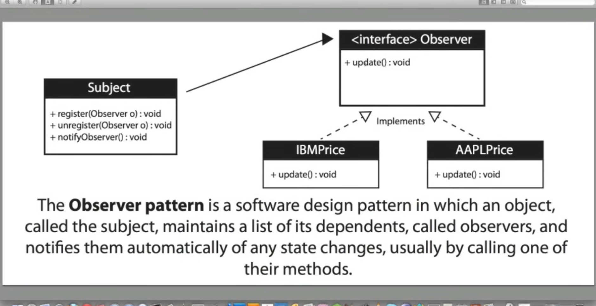

When you need many other object to receive an update when another object changes
  --Loose coupling

- problem statement:
    Objects which are keeping track of stock prices, so if there is change in any value of stock all object 
    should be notified