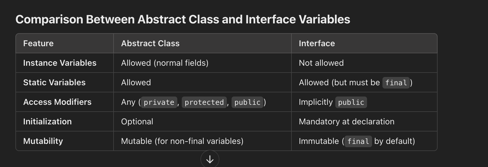
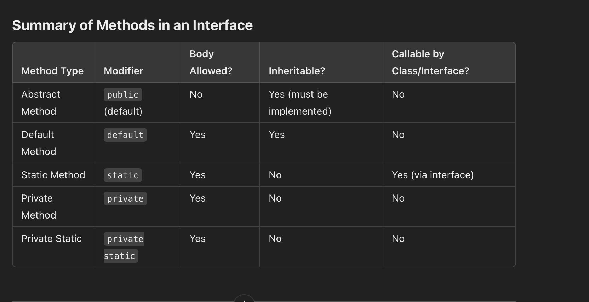

You are developing an e-commerce application where users can calculate shipping costs for their orders. The shipping cost depends on the type of shipping selected, and the logic for each shipping type varies. The application should support the following shipping strategies:

Standard Shipping: A flat rate of $5 per order.
Express Shipping: A rate of $10 per order plus $2 per kilogram of the order's weight.
Same-Day Delivery: A rate of $20 per order plus $5 per kilogram of the order's weight.
The application should allow adding new shipping strategies in the future without modifying the existing codebase, adhering to the Open-Closed Principle.

